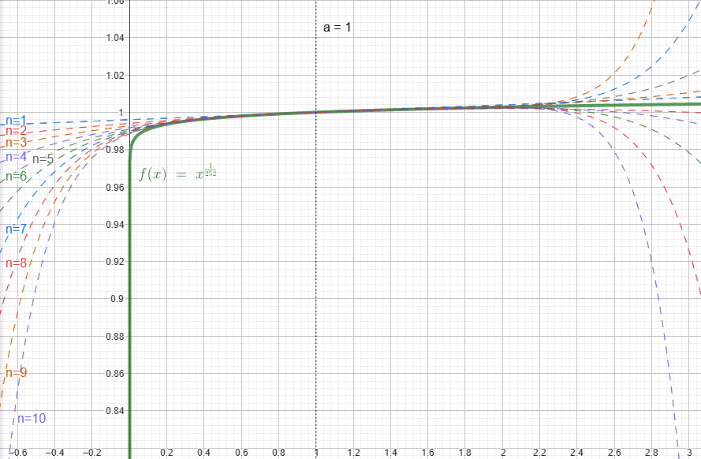

+++
title = 'Usando matemática para resolver computação de cálculo de juros'
date = 2025-03-23T12:00:00-03:00
draft = false
math = true
+++

# Introdução

Apesar da minha formação em matemática aplicada, atuo como engenheiro de software há vários anos e no meu dia-a-dia do trabalho são raras as situações onde acho aplicações diretas do que aprendi na universidade.

Esse artigo conta uma situação onde consegui aplicar alguns conceitos matemáticos que foram *game-changer* em um projeto de investimentos que participei.

Como esse tipo de situação é raro, acredito ser importante compartilhar para ajudar a combater aos poucos a visão de educação utilitarista, que costuma aparecer muito em candidatos que entrevisto com frases na linha de:

> *"Esse tipo de pergunta não faz sentido, não aplicamos isso no dia-a-dia, é inútil."*

Dito isso, apesar de ser um tema que possui uma aura de "complexo", os conceitos matemáticos não são tão dificéis assim e geralmente estão contidos nas ementas dos cursos superiores de computação e/ou no próprio ensino médio.

# O problema do cálculo de taxa de juros

Há algum tempo tive a oportunidade de trabalhar em um projeto recém criado em um time de investimentos de uma fintech brasileira.

Quando pensamos em investimentos, é imediato pensarmos sobre taxas de juros e os cálculos necessários para manipular esses valores, e de fato isso foi um grande desafio no início do projeto.  Por isso, foi necessário estabelecer alguma método para calcular rendimentos dos investimentos dos clientes, dado uma taxa de juros anual.

Como o volume de investimentos era muito grande, o volume de uso desse método de cálculo também seria muito grande, então ele precisaria ser rápido. Além disso, nos primeiros anos de atividade da aplicação, o número de investimentos tendia a crescer muito todos os dias (apesar de várias estratégias para diminuir esta cardinalidade), então sempre tinhamos que trabalhar com previsões pessimistas de performance. Nós sabíamos que eventualmente o número de novos investimentos e investimentos resgatados se balanceariam e teríamos alguma estabilidade na  carga da aplicação, mas esse momento estava longe de chegar.

Além do volume, o método teria que atender alguns requisitos importantes:
1. Precisão alta, na ordem de 30 casas decimais.
2. As taxas de juros disponibilizadas pelos órgãos reguladores eram atualizadas diariamente, e eram fornecidas como taxa de juros **anual**.

Um problema que surge do ponto 2, é que apesar da taxa informada ser anual, nós precisamos aplicar juros diariamente (ou mensalmente), isto é, precisamos transformar a taxa de juros anual em uma taxa diária, considerando os dias corridos do ano.

As regras desta transformação poderiam variar dependendo do tipo de ativo. A quantidade de dias considerados em um ano corrido (DCC, *day count convention*) poderia ser tanto 252 (apenas dias úteis) quanto 360 (todos os dias). 

A taxa de juros anual $R_{total}$, é calculada da seguinte forma:

$$ R_{\text{total}} = \Bigg( \prod_{i=0}^{c} \big(1+R_{i}\big) \Bigg) -1$$
Sendo $R_{i}$ como a taxa diária do $i$-ésimo dia passado, e $c$ como o DCC escolhido (252 ou 360).

Exemplificando a fórmula, em um cenário aonde temos rendimentos de $10\%$ e $15\%$, e usando o número de dias como $c=2$, podemos ter um juros total de:

$$
	R_{\text{total}} = ((1+10\%)(1+15\%)) - 1 = ((1.1)(1.15)) - 1 = 1.265-1 = 26.5\%
$$

Como a taxa **anual** é obtida através da multiplicação das taxas de juros **diárias** do último ano corrido, em dias, precisamos fazer a "operação inversa", isto é, obter uma taxa diarizada a partir da taxa anual. Para isso, podemos calcular a média geométrica da taxa anual para obter a taxa diarizada. Isto está sendo representado na seguinte expressão:

$$
R_{\text{avg}} = \Bigg(\sqrt[c]{1+R_{\text{total}}}\Bigg)-1
$$

Sendo $R_{avg}$ a taxa diária, isto é, a média geométrica da taxa do ano, considerando o DCC.

Para exemplificar a fórmula, no exemplo que usamos anteriormente (rendimentos de $10\%$ e $15\%$ e número de dias $c=2$), temos:

$$
R_{\text{avg}} = \sqrt[2]{1+26.5\%}-1 = \sqrt[2]{126.5\%}-1 \approx 1.125 - 1 = 0.125 = 12.5\%
$$

Parece simples! Só precisamos conseguir calcular a raíz $n$-ésima, isso é fácil, certo? A priori, você pode pensar que essa função já está disponibilizada na standard library do *Golang*, através da `math.Pow(float64, float64)`, e então problema estaria resolvido. Porém, precisavamos de muita precisão no domínio de investimentos, sendo impossível o uso de pontos flutuantes para representar as taxas de juros.

A necessidade de precisão tornou obrigatório o uso de estruturas numéricas de precisão  arbitrária (na época, usando a [shopspring/decimal](https://github.com/shopspring/decimal)). Por esta escolha, acabamos caindo também em outros problemas:
1. Converter os decimais de precisão arbitrária para pontos flutuantes para fazer o cálculo com a `math.Pow` não era uma possibilidade, dado a perda de precisão.
2. Em geral, decimais de precisão arbitrária possuem um *slice* por de baixo dos panos, fazendo com que o custo de alocações e garbage collector seja muito alto, tanto para representações numéricas, quanto para realizar operações matemáticas.
3. Computar a raíz de um número não é uma operação matemática básica que pode ser realizada de forma direta, geralmente sendo resolvida com VÁRIAS iterações de VÁRIAS outras operações matemáticas básicas (derretendo o GC e memória, dado o ponto 2).
4. Na época, as libs que conhecíamos (nem mesmo o pacote decimal) não forneciam funções que computavam a raíz de números decimais genéricos.

A escolha que tomamos para endereçar esses problemas foi a de implementarmos nós mesmos algum método matemático que calculasse a raiz $n$-ésima. Então escolhemos estudar o uso de Série de Taylor para este problema.

# Série de Taylor

A ideia do artigo não é entrar nos detalhes de como funciona a Série de Taylor, mas a ideia é basicamente aproximar a função da raíz $n$-ésima de um número.

A Série de Taylor fornece uma fórmula de somátorio infinito que apróxima uma função genérica $f(x)$ em torno de um valor de $x=a$. A fórmula é a seguinte:

$$ f(x) = \sum_{n=0}^{\infty} \frac{f^{(n)}(a)}{n!} (x-a)^n $$
A única operação "analítica" encontrada na fórmula é a $f^{(n)}(x)$, que significa a $n$-ésima derivada da função original. Apesar de poder ser considerada complexa, é uma operação que está dentro da ementa da maioria dos cursos de Ciência da Computação. Portanto, decidimos nos aprofundar na escolha da Série de Taylor.

Como estamos falando de computação, uma soma infinita não parece muito factível. Porém, a Série de Taylor também nos fornece uma fórmula para calcular o erro do cálculo quando expandimos o somatório até um determinado valor $n$:

$$
E_n(x) = \frac{f^{(n+1)}(a)}{(n+1)!}(x-a)^{(n+1)}
$$

Isso é excelente, porque a precisão que desejamos já é conhecida, então conseguimos parar a soma infinita a medida que atingirmos um erro menor do que a precisão que desejamos.

O GIF à seguir mostra como a Série de Taylor se comporta em uma função genérica à medida que aumentamos o $n$ da expansão:

# Encaixando Taylor em nosso problema

O maior problema aqui é calcular o valor de $f^{(n)}(x)$, de forma a podermos computa-lo numericamente, então vamos explorar essa análise neste artigo.

Primeiramente, pra facilitar a representação, vamos substituir a raíz $n$-ésima por uma potência equivalente:

$$ f(x) = \sqrt[c]{x} \longrightarrow f(x) = x^{\frac{1}{c}} $$

Neste caso, conseguimos aplicar a simples regra de derivada de monômios, onde:

$$
f(x) = x^{m} \longrightarrow f'(x) = mx^{m-1}
$$

Portanto, aplicando em nossa função e simplificando o expoente, temos:

$$
f^{(1)}(x) = \frac{1}{c}x^{\big(\frac{1}{c} - 1\big)} \longrightarrow f^{(1)}(x) = \frac{1}{c}x^{\big(\frac{1-c}{c}\big)}
$$

Agora, para gerarmos alguma "intuição indutiva", vamos encontrar $f^{(2)}(x)$ a partir de $f^{(1)}(x)$:

$$ f^{(2)}(x) = (f^{(1)}(x))' $$

Aplicando as mesmas regras e simplificando:

$$ f^{(2)}(x) = \Bigg(\frac{1}{c}x^{\bigg(\frac{1}{c} - 1\bigg)}\Bigg)'  \longrightarrow f^{(2)}(x) = \bigg(\frac{1}{c}\bigg)\bigg(\frac{1-c}{c}\bigg)x^{\frac{1-2c}{c}} $$

$$ \longrightarrow f^{(2)}(x) = \frac{1}{c^{2}}  (1 - c) x^{\frac{1-2c}{c}} $$

Continuando a indução, podemos calcular $f^{(3)}(x)$:

$$ f^{(3)}(x) = \bigg(f^{(2)}(x)\bigg)' $$

Expandindo e isolando as frações:

$$ f^{(3)}(x) = \Bigg(\bigg(\frac{1}{c}\bigg)\bigg(\frac{1-c}{c}\bigg)x^{\bigg(\frac{1-2c}{c}\bigg)}\Bigg)'  \longrightarrow f^{(3)}(x) = (\frac{1}{c})(\frac{1-c}{c})(\frac{1-2c}{c})x^{\frac{1-3c}{c}} $$

$$ \longrightarrow f^{(3)}(x) = \frac{1}{c^{3}}  (1 - c)(1-2c) x^{\frac{1-3c}{c}} $$

Com isso conseguimos notar alguns padrões que surgirão caso continuemos derivando. Com esses padrões, podemos chegar na seguinte fórmula para um caso genérico $f^{(n)}(x)$:

$$ f^{(n)}(x) = \Bigg(\frac{1}{c^{n}} \prod_{i=1}^{n-1} (1 - ic) \Bigg) x^{\frac{1-nc}{c}} $$

Nesta estrutura, fica claro uma vantagem computacional muito importante:

$$ f^{(n)}(x) = \underbrace{\Bigg(\frac{1}{c^{n}} \prod_{i=1}^{n-1} (1 - ic) \Bigg)}_\text{constant} x^{\frac{1-nc}{c}} $$

Isto é, dado um valor $n$, o primeiro termo entre parenteses é uma constante que depende apenas de $c$ (isto é, o DCC utilizado)! Isto significa que ele pode ser pré-computado, dado que nossos valores de $c$ são pouco variados e todos conhecidos (252 e 360).

Fazendo uma simples substituição de $f^{(n)}(x)$ na fórmula da Série de Taylor, temos:

$$
f(x) = \sum_{n=0}^{\infty} \frac{\Bigg(\frac{1}{c^{n}} \prod_{i=1}^{n-1} (1 - ic) \Bigg) a^{\frac{1-nc}{c}}}{n!} (x-a)^n
$$
E simplificando:

$$
f(x) = \sum_{n=0}^{\infty} \frac{1}{c^{n}n!} \Bigg(\prod_{i=1}^{n-1} (1 - ic) \Bigg) a^{\frac{1-nc}{c}} (x-a)^n
$$

Porém, assim como antes, temos os termos $n$, $c$ e $a$ conhecidos, portanto:

$$
f(x) = \sum_{n=0}^{\infty} \underbrace{\frac{1}{c^{n}n!} \Bigg(\prod_{i=1}^{n-1} (1 - ic) \Bigg) a^{\frac{1-nc}{c}}}_\text{constant} (x-a)^n
$$
Também conseguimos aproveitar do fato de todos os termos serem conhecidos e constantes para realizar uma pré-computação dos termos e economizarmos operações e alocações em tempo de execução.

Porém, apesar de termos descoberto a fórmula para os termos do somatório, ainda existe um problema muito bobo que os mais atentos podem ter notado: Como vamos calcular $a^{\frac{1-nc}{c}}$?

A expressão $a^{\frac{1-nc}{c}}$ pode ser re-organizada como $(a^{1-nc})^{\frac{1}{c}}$, ou $\sqrt[c]{a^{1-nc}}$, isto é, ainda teremos que calcular a raíz $n$-ésima de um número. Nós não contornamos o problema, porque a solução também necessita calcular o função original, é um questão cíclica, haha!

... ou será que não?

Apesar de termos entrado em pânico à primeira vista, desconsideramos um fator muito importante em nossa análise: A realidade material. Então vamos lá!

Para que estamos calculando a raiz $n$-ésima? Diarizar taxas de juros; Quais são as taxas de juros que estamos diarizando? Apesar do Brasil não ser conhecido como um país de taxas de juros baixas, costumamos não passar de 20% ao ano; Qual a finalidade do valor $a$? É ser o ponto que define a redondeza na qual Série de Taylor aproximará a função original $f(x)$;

Considerando isso, e nos lembrando do nosso problema original:

$$
R_{avg} = \Bigg(\sqrt[c]{1+R_{y}}\Bigg)-1
$$

Estamos na verdade calculando a raíz $n$-ésima de algum número que estará sempre orbitando o intervalo $(100\%, 120\%)$, isto é, algo entre $1$ e $1.2$.

Porém, pera aí! Se podemos considerar $a = 1$ para ser nossa vizinhança de aproximação, o que acontece com a expressão $a^{\frac{1-nc}{c}}$?

Lembrando da época do ensino médio, 1 elevado à qualquer número é igual à 1, isto é:

$$
1^{\frac{1-nc}{c}} = 1
$$
Então simplesmente MATAMOS O PROBLEMA! Nós interrompemos a questão cíclica de calcular a raíz $n$-ésima de um número e agora podemos simplesmente implementar o código!

Fazendo a substituição de $a=1$ no problema original, temos:

$$
f(x) = \sum_{n=0}^{\infty} \frac{1}{c^{n}n!} \Bigg(\prod_{i=0}^{n-1} (1 - ic) \Bigg)  (x-1)^n
$$

Podermos inclusive extrair $n=0$ do somário, dado que ele é sempre uma constante 1, isto é:

$$
\frac{1}{c^{0}0!}  (1 - 0c)   (x-1)^0 = 1
$$

Substituindo, temos:
$$
f(x) = 1 +\sum_{n=1}^{\infty} \frac{1}{c^{n}n!} \Bigg(\prod_{i=1}^{n-1} (1 - ic) \Bigg)  (x-1)^n
$$

Abaixo conseguimos ver uma as expansões da nossa função (para DCC 252) até $n=10$:

Como estamos computando $\sqrt[c]{x+1} -1$, isto é $f(x+1)-1$, podemos simplificar a expressão, definindo uma $r(x)$ como:

$$
r(x) = f(x+1) - 1 = \sqrt[c]{x+1} -1
$$
$$
\longrightarrow r(x) = \Bigg[ 1 +\sum_{n=1}^{\infty} \frac{1}{c^{n}n!} \Bigg(\prod_{i=1}^{n-1} (1 - ic) \Bigg)  ((x+1)-1)^n \Bigg] -1
$$

Obtendo:

$$
r(x) = \sum_{n=1}^{\infty} \frac{1}{c^{n}n!} \Bigg(\prod_{i=1}^{n-1} (1 - ic) \Bigg)  x^n
$$

Onde a expansão agora é em torno de $x= 0$, dado que $x +1 = 1 \longrightarrow x = 0$.

# Implementação

Após uns meses da minha implementação da expansão de Taylor no projeto de investimentos, o pacote `shopspring/decimal` passou a dar  suporte à exponenciação de valores arbitrários.

A priori pensei que era uma boa notícia, dado que o pacote da shopspring é amplamente utilizado pela comunidade, e deveria ter olhos atentos para questões de performances. Fiz então um benchmark comparando diretamente minha implementação (específica para expoentes no formato $1/c$ em torno de 1) à implementação genérica do pacote shopspring.

No benchmark tive uma surpresa, minha implementação era 100x mais rápida e com menos alocações em relação ao pacote shopspring. Além disso, existe uma [issue](https://github.com/shopspring/decimal/issues/368) aberta onde o caching de números fatoriais (em variáveis globais) gera uma race condition, gerando problemas ao rodar o código de forma concorrente. 

Com a finalidade de compartilhar um exemplo de código durante a escrita desse artigo, resolvi reimplementar e publicar a implementação da expansão no repositório  [mqzabin/tsratecalc](https://github.com/mqzabin/tsratecalc).

Esse repositório fornece uma implementação "genérica" da expansão para qualquer tipo decimal de precisão arbitrária que respeite as interfaces necessárias. Entretanto, é importante pontuar que esta generalização através do uso de interfaces gera um custo relativamente alto de alocações.

Mesmo assim, a diferença no benchmark entre a implementação genérica do shospring e minha implementação (também utilizando o tipo contreto da shopspring) chega a 5x (tanto em alocações quanto em velocidade).
